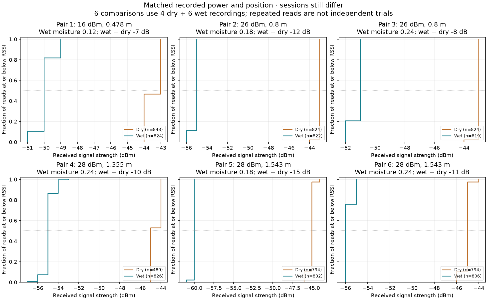

# Dryguard — RFID moisture exploration

Can RFID signals help distinguish moisture conditions? This project explores
public **soil** measurements as an early step toward studying laundry dryness.
It demonstrates data validation, recording-level summaries, and comparisons
with matching recorded settings. No classifier has been trained, and the soil
results do not validate a laundry detector.



## Findings

- The initial subset contains **60 recordings and 54,537 reader events**.
  A reader event is one repeated measurement, not an independent experiment.
- Its dry and wet recordings differ in session, power and position. Only one
  dry/wet pair shares power and has recorded positions within 5 cm; this is an
  exploratory tolerance, not a guarantee of equivalent conditions.
- Six additional wet recordings match the exact power and `pos_y` of four
  existing dry recordings. Recorded tag type, frequency, antenna index and
  depth also match. The six comparisons reuse two dry recordings.
- Wet median RSSI is **7–15 dB weaker** in these comparisons. Greater reported
  moisture does not consistently produce weaker RSSI.
- Sessions still differ for every pair. Matching these recorded settings does
  not establish an unchanged physical setup or a causal moisture effect.

## Run it locally

Use Python 3.12. From the project folder, create an environment and install the
versions used for the verified run (recorded on macOS with Apple Silicon):

```bash
python3 -m venv .venv
source .venv/bin/activate
python -m pip install -r requirements-lock.txt
python scripts/download_data.py
jupyter lab
```

On Windows, activate with `.venv\Scripts\activate` instead. The lock file records
this tested environment, not a cross-platform guarantee. `requirements.txt`
contains broader dependency ranges for other compatible environments.

Open `notebooks/01_explore_rfid_moisture.ipynb` and run it from top to bottom.
In VS Code, select `.venv` as the notebook kernel. Paths work from either the
project root or the `notebooks` directory.

Raw CSVs are excluded from Git. The downloader restores **66 unique files**
from a pinned source commit and verifies each file's size and Git blob hash.
It uses both manifests and downloads the four reused dry files only once.
It requires internet access for missing or changed files. Once restored,
the notebook runs offline without RFID hardware.

## Notebook guide

1. Load individual reader events and inspect the columns.
2. Check labels, missing values and basic consistency.
3. Summarize each recording using median RSSI and within-recording spread.
4. In **3a**, inspect the original subset for comparable power and position.
5. In **3b**, compare the additional matched recordings and their distributions.
6. Examine session confounding, changing settings and one recording's trace.

Each plot in section 3b is an empirical cumulative distribution: the horizontal
axis is RSSI and the vertical axis is the fraction of reads at or below that
strength. Farther right means stronger. These curves describe repeated reads;
they are not confidence intervals or independent moisture trials.

## Project files

| Path | Purpose |
| --- | --- |
| `notebooks/01_explore_rfid_moisture.ipynb` | Guided analysis with saved outputs |
| `data/manifest.json` | Original 60-file selection and hashes |
| `data/matched/manifest.json` | Six matched pairs across ten unique recordings |
| `scripts/download_data.py` | Restore and verify all 66 unique source files |
| `reports/recording_summary.csv` | Original recording summaries |
| `reports/recording_comparison.csv` | Original summaries with RSSI spread |
| `reports/same_power_pairs.csv` | All original-subset same-power comparisons |
| `reports/near_position_pairs.csv` | Original same-power pairs within 5 cm |
| `reports/matched_recordings.csv` | Six comparisons with exact power and position |
| `reports/matched_distributions.png` | Matched recording distributions |
| `reports/rfid_exploration.png` | Original-subset overview |
| `reports/execution_environment.json` | Verified execution environment and result |
| `docs/DATA_CARD.md` | Dataset selection, interpretation and limitations |
| `docs/source/` | Preserved upstream README, citation and license |

## Limitations and next steps

All explicitly dry-labeled soil filenames in the audited source inventory belong
to one collection session. The filename audit does not rule out additional dry
observations under other labels. A random split of reader events would mix reads
from the same recording between training and testing. Holding out files alone
would not demonstrate performance on new sessions.

The next experimental need is independently collected dry and wet observations
under controlled conditions across multiple sessions. For the laundry goal,
collect textile measurements with an independent moisture reference and evaluate
on entire unseen drying runs. `moist`, `obs`, filenames and session identifiers
must not be used as inputs to a signal-only moisture classifier.

## Sources and credit

Data and upstream tools: Wireless Information Networking Group, UAB;
Nedal Martínez Benelmekki and Elvis Díaz Machado.

- [Source repository](https://github.com/Wireless-Information-Networking/RFID-Reader-FX7500)
- [Pinned commit](https://github.com/Wireless-Information-Networking/RFID-Reader-FX7500/tree/790b419e86b508c38487d679658a8bad266237be)
- [Dataset record](https://doi.org/10.34810/data2325)

These files were acquired from GitHub; equivalence with the Dataverse archive
has not been verified. The upstream repository's MIT notice and citation are
preserved in `docs/source/`. The source measurements and reader software are the
upstream authors' work. This project's contribution is the selection audit,
notebook analysis, matched comparisons and interpretation.
